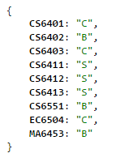
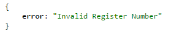

# AUScrapper
An ultra-cool script that returns a JSON of Anna University Semester Result for the given register number.

# Demo

# Running the Program
* INPUT
  * The Register Number should be passed as a query string inside `regno` parameter.

* OUTPUT
  * A JSON with subject code as property and grade as value on success, else a property error.
